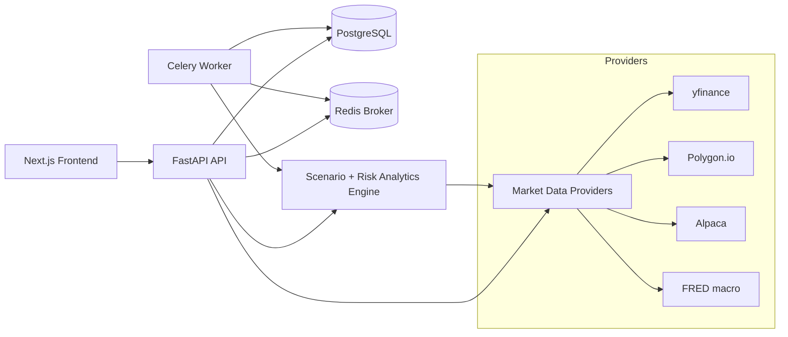

# Market Scenario and Stress Testing Workbench

Market Scenario and Stress Testing Workbench is a full-stack portfolio risk application designed to look and behave like a serious institutional decision-support tool. It combines a FastAPI backend, a Next.js frontend, and a quantitative analytics layer to help a user understand how a portfolio behaves under historical crises and hypothetical macro shocks.

It answers three questions a portfolio manager actually asks:

1. How much would I lose if 2008 or COVID happened again?
2. What breaks first — and which positions and sectors drive the loss?
3. What hedges would reduce my downside, and at what cost?

## Architecture Diagram



## Current Status

The application is functional end to end:

- **Data layer** — `DataProvider` abstraction (yfinance / Polygon / Alpaca) with parquet caching, FRED macro fetcher, vectorized returns/vol/correlation, and a Fama-French loader.
- **Portfolio engine** — JSON/CSV/preset ingestion, sector & asset-class tagging, nominal analytics, and Fama-French factor decomposition (beta / SMB / HML with t-stats).
- **Scenario engines** — historical replay (2008, 2020, 2018 Q4, 2022, dot-com) and a hypothetical shock engine (equity, rates, tech, VIX, oil, HY credit, custom), both reachable through the API and executed synchronously or via Celery.
- **Risk** — historical VaR/CVaR, drawdown & recovery, concentration (HHI, top-N), liquidity-adjusted loss, and an explainable hedge-suggestion engine.
- **API** — typed Pydantic request/response models for every endpoint; CORS enabled for the frontend.
- **Frontend** — seven working pages (overview, builder, historical, hypothetical, risk, recommendations, settings) with loading skeletons, error+retry states, and an explainability tooltip on every metric.
- **Tests** — 235 passing pytest unit/integration tests across analytics, scenario execution, serialization, and the API.

## Setup Instructions

1. Copy `.env.example` to `.env`: `cp .env.example .env`.
2. Start the stack: `docker compose up --build` (Postgres, Redis, backend, Celery worker, frontend).
3. Run migrations: `cd backend && alembic upgrade head`.
4. Seed demo data (four preset portfolios; scenario runs are executed against the configured data provider): `cd backend && python -m app.db.seed`.
   - Add `--no-execute` to leave runs in the `pending` state, or `--sqlite demo.db` to seed a standalone SQLite file with no Postgres.
5. Open `http://localhost:3000` (frontend) and `http://localhost:8000/docs` (API docs).

Run the backend tests with `cd backend && pytest`.

### Running pieces without Docker

- Backend: `cd backend && pip install -e . && uvicorn app.main:app --reload`
- Frontend: `cd frontend && npm install && npm run dev` (set `NEXT_PUBLIC_API_URL=http://localhost:8000`)
- Scenario execution mode: `SCENARIO_EXECUTION_MODE=sync` (default, runs inline) or `celery` (enqueues to the worker).

## Feature List

- Portfolio ingestion via manual entry, CSV upload, and one-click preset templates
- Historical stress replay using real daily returns, with PnL attribution and before/during correlation shifts
- Hypothetical shock framework (equity, rates, tech, VIX, oil, credit, custom) with factor-based approximations
- Liquidity-adjusted risk (days-to-liquidate at multiple participation rates, haircut on stressed loss)
- Explainable hedge suggestions with step-by-step hedge-ratio math and estimated cost
- Similar historical periods via cosine similarity on a macro feature vector
- Full explainability layer: every displayed metric has a what/how/why tooltip

## Data Sources and Licensing Notes

- Primary market data provider abstraction targets Polygon.io or Alpaca
- Macro series are sourced from FRED (rates, VIX, credit spreads, yield curve, USD index)
- `yfinance` is supported as a development fallback behind the provider interface
- Fama-French factors come from the Ken French data library
- Review each provider's licensing terms before production or public deployment. All credentials are supplied via environment variables; none are committed.

## Design Tradeoffs and Limitations

- **Instantaneous shocks are approximations.** Equity shocks scale by market beta, rate shocks by duration / rate sensitivity, and cross-sector spillovers use historical correlations. These are transparent first-order estimates, not full revaluation.
- **Simulated drawdown paths are illustrative**, scaling the instantaneous shock by historical volatility — they are not Monte Carlo simulations.
- **Historical replay assumes no rebalancing** inside the scenario window and shocks current notionals through realized returns.
- **Transaction costs and slippage are simplified**; the liquidity haircut is a parameterized proxy, not an execution model.
- Postgres and Redis are expected in the intended local/dev environment; a SQLite seed path exists for quick demos.

## Future Work

- Full portfolio revaluation under shocks (option-aware, non-linear) instead of first-order factor approximations
- Monte Carlo and parametric VaR alongside the current historical VaR
- Persisted scenario-run history and comparison views in the UI
- Playwright end-to-end tests for the key frontend flows
- Authentication and multi-user portfolios

## Repository Structure

```
stress-engine/
├── AGENTS.md                      # build specification
├── README.md
├── docker-compose.yml             # postgres, redis, backend, worker, frontend
├── Makefile
├── .env.example
├── docs/
│   └── demo-script.md             # 3–5 minute walkthrough
├── sample-data/
│   └── sample_portfolio.csv
├── backend/
│   ├── Dockerfile  pyproject.toml  pytest.ini  alembic.ini
│   ├── alembic/                   # migrations (0001_initial_schema)
│   └── app/
│       ├── main.py                # FastAPI app + CORS
│       ├── api/                   # routes + deps (health, portfolios, scenarios, scenario-runs, similar-periods)
│       ├── core/                  # config, logging
│       ├── db/                    # SQLAlchemy models, session, seed
│       ├── domain/
│       │   ├── data/              # DataProvider impls, cache, FRED, Fama-French, returns
│       │   ├── portfolio/         # loader, analytics, metadata, presets
│       │   ├── risk/              # VaR/CVaR, liquidity, hedges, similar-periods
│       │   └── scenarios/         # historical replay + hypothetical shock engines
│       ├── schemas/               # Pydantic request/response models
│       ├── services/              # orchestration: portfolio, scenario, executor, serialization, analytics
│       └── workers/               # celery app + scenario task
│       └── tests/                 # 235 pytest tests
└── frontend/
    ├── Dockerfile  package.json  next.config.ts  tailwind.config.ts  tsconfig.json
    ├── app/                       # 7 pages + home + layout
    ├── components/                # charts, layout, portfolio context, ui primitives
    └── lib/                       # typed API client, types, formatters, useApi hook
```
