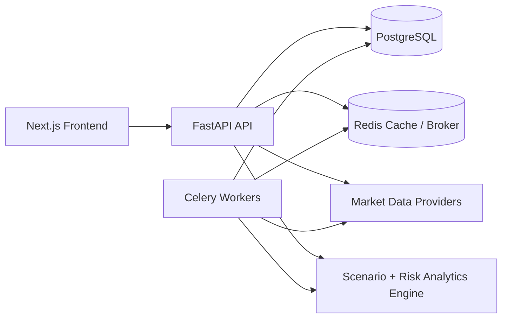

# Market Scenario and Stress Testing Workbench

Market Scenario and Stress Testing Workbench is a full-stack portfolio risk application designed to look and behave like a serious institutional decision-support tool. The project combines a FastAPI backend, a Next.js frontend, and a quantitative analytics layer to help a user understand how a portfolio behaves under historical crises and hypothetical macro shocks.

The recruiting goal shapes the engineering choices: each quantitative method is explainable from first principles, the system is modular enough to discuss in interviews, and the product experience emphasizes interpretability rather than black-box outputs. The application is intended to demonstrate sound software design, practical data engineering, and disciplined financial analytics in one cohesive system.

## Architecture Diagram

## Current Status

Phase 1 scaffold is in place:

- Docker-based local development stack
- Backend service shell with config, logging, database models, Alembic, and Celery bootstrap
- Frontend app-router shell with page placeholders for all required product surfaces
- Sample upload artifact and initial documentation structure

## Setup Instructions

1. Copy `.env.example` to `.env`.
2. Start infrastructure and app containers with `docker compose up --build`.
3. Run database migrations with `cd backend && alembic upgrade head`.
4. (Optional) Seed demo data — the four preset portfolios plus pending scenario runs — with `cd backend && python -m app.db.seed`. Add `--sqlite demo.db` to seed a standalone SQLite file without Postgres.
5. Open `http://localhost:3000` for the frontend and `http://localhost:8000/docs` for the backend docs.

## Feature List

- Portfolio ingestion via manual entry, CSV upload, and preset templates
- Historical stress replay engine using real market data
- Hypothetical shock framework with factor-based approximations
- Liquidity-adjusted risk analysis
- Explainable hedge suggestions and similar-period lookup
- Full explainability layer for every displayed metric

## Data Sources and Licensing Notes

- Primary market data provider abstraction targets Polygon.io or Alpaca
- Macro series are sourced from FRED
- `yfinance` is supported as a development fallback behind the provider interface
- Users should review provider licensing terms before production or public deployment

## Design Tradeoffs and Limitations

- Phase 1 focuses on durable scaffolding and interfaces rather than analytics depth
- PostgreSQL and Redis are required in the intended local/dev environment
- Some pages and endpoints are placeholders until later modules are implemented

## Future Work

- Build the provider abstraction and parquet-backed caching layer
- Implement portfolio analytics, scenario engines, and recommendations
- Add seeded demo results, richer testing, and polished interaction flows

## How to talk about this project in SWE, quant, and consulting interviews

### SWE version

Emphasize the provider abstraction, the FastAPI service boundaries, the Alembic-backed schema evolution, the Celery task queue for long-running runs, and the split between API orchestration and analytics modules.

### Quant version

Emphasize the factor decomposition framework, the historical replay engine, the liquidity-adjusted loss logic, the hedge ratio calculations, and the discipline of using real historical data rather than synthetic scenarios.

### Consulting version

Emphasize the decision-support framing, the explainability layer for every risk metric, the recommendation engine rationale, and the way the product translates technical portfolio risk into actionable management guidance.

